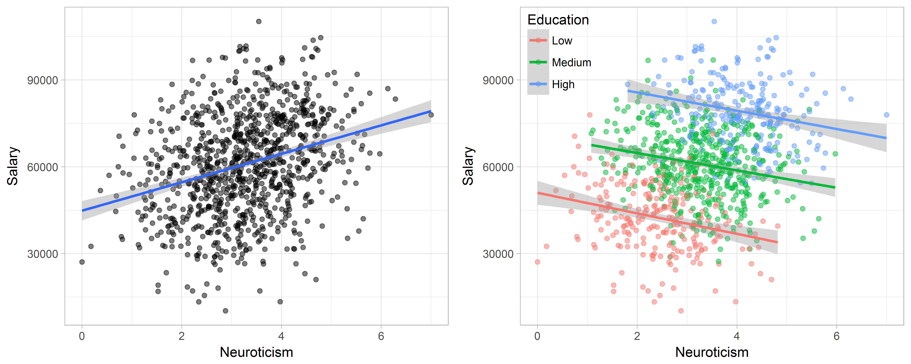

```{r setup, include=FALSE}
knitr::opts_chunk$set(echo = FALSE)
```

## Schedule Information

- HW3 Due 7/17


## Outline

Two unrelated topics:

- Hierarchical models
- Dealing with model uncertainty


## Hierarchical models

Why are we talking about **hierarchical models**?

- when you need them, you need them
- HMC and NUTS have a hard time with them unless you reparameterize


## Conditional IID (aka Exchangeability)

Most setups in Bayesian ML:

- $\theta \sim \text{prior}$
- $y_1, \ldots, y_n \mid \theta$ independent and identically distributed

Does your data violate this assumption?

- time series
- repeated measures/longitudinal data
- **clusters/groups**

## Simpson's "Paradox" (an aside)

```{r, fig.cap="source: https://paulvanderlaken.com/2017/09/27/simpsons-paradox-two-hr-examples-with-r-code/"}

```


## Hierarchical Regression

Regular regression:

- $y_i \mid a, b, \sigma^2,  x_i \sim \text{Normal}(a + b x_i, \sigma^2)$
- prior: $p(a, b)p(\sigma^2)$

Hierarchical Regression:

- $y_{ij} \mid a_j, b_j, \sigma^2,  x_{ij} \sim \text{Normal}(a_j + b_j x_{ij}, \sigma^2)$
- prior: $\{ \prod_j p(a_j, b_j \mid \theta)\} p(\theta)p(\sigma^2)$


TLDR: 

- each group gets its own intercept and slope
- overfitting is prevented by "tying together" betas in the prior


## Hierarchical Regression in PYMC3


Demo time... `hierarchical_model_demo.ipynb`


## Model Uncertainty

Changing gears now...

"All models are wrong." What do we do about this?

- Ignore model uncertainty
- Expand/revise your working model
- select one model from several (e.g. hypothesis testing, choosing one with best OOS predictions)
- Average/blend many models together


## Choosing one from many: option 1

Fit a bunch of models and pick the one that predicts the best. This is the same as picking the model with the best *scoring rule* or *information criterion* score:

$$
\mathbb{E}_{\tilde{y}}[-\log p(\tilde{y}) ]
$$

- $y$ is your data set
- $\tilde{y}$ is future data
- $p(\tilde{y})$: frequentists use $p(y \mid \hat{\theta})$, Bayesians use $p(\tilde{y} \mid y)$
- this quantity isn't even close to being tractable

## Choosing one from many: option 1

$$
\mathbb{E}_{\tilde{y}}[-\log p(\tilde{y}) ]
$$
can be approximated by 

- train/test splits (e.g. $S^{-1} \sum_{j=1}^S -\log p(\tilde{y}_j)$)
- cross-validation (i.e. many train/test splits, usually computationally brutal)
- AIC,WAIC,BIC,DIC etc. (use all your data--no split; goodness of fit $+$ penalty term)


## Choosing one from many: option 2

Then there's hypothesis testing: 

- null hypothesis: $M_1$ an entire model with prior $p(\theta_1 \mid M_1)$
- alternative: $M_1$ a different model with totally different set of parameters--prior: $p(\theta_2 \mid M_2)$
- also have prior beliefs on which model is the true model $P(M_1)$ and $P(M_2)$

\begin{align*}
\frac{p(M_2 \mid y)}{p(M_1 \mid y)} 
&=
\frac{p(y \mid M_2 ) p(M_2) \bigg/ p(y) }{p(y \mid M_1 ) p(M_1) \bigg/ p(y) } \\
&=
\underbrace{\frac{p(y \mid M_2 )   }{p(y \mid M_1 )  } }_{\text{Bayes factor}}
\frac{p(M_2)  }{p(M_1)  }
\end{align*}


## Choosing one from many: option 2


\begin{align*}
\frac{p(M_2 \mid y)}{p(M_1 \mid y)} 
&=
\underbrace{\frac{p(y \mid M_2 )   }{p(y \mid M_1 )  } }_{\text{Bayes factor}}
\frac{p(M_2)  }{p(M_1)  }
\end{align*}

model evidence: 
$$
p(y \mid M_2 ) = \int p(y \mid \theta_2, M_2 )p(\theta_2 \mid M_2 )d \theta_2
$$
BFs are tricky:

- evidences are sensitive and can be difficult to calculate/approximate
- BDA3 text dismisses them and favors "continuous model expansion"


## Averaging Many Models Together


**Bayesian Model Averaging** is an overarching principle that follows from simple definitions:

$$
p(\tilde{y} \mid y) = \sum_i p(\tilde{y} \mid M_i, y) p(M_i \mid y)
$$

- weights: $p(M_i \mid y)$
- predictions: $p(\tilde{y} \mid M_i, y)$
- a good review: `https://www.jstor.org/stable/2676803 `

## Averaging Many Models Together

It's difficult:

$$p(\tilde{y} \mid y) = \sum_i p(\tilde{y} \mid M_i, y) p(M_i \mid y)$$


- $p(M_i \mid y) \propto  p(M_i) \int p(y \mid \theta_i, M_i)p(\theta_i \mid M_i) d \theta_i p(M_i)$
- $p(\tilde{y} \mid M_i, y) = \int p(\tilde{y} \mid \theta_i, M_i) p(\theta_i \mid M_i, y) d \theta_i$
- list out all possible models, compute posteriors for each one, then posterior predictive distributions, then prior predictive distributions...
- alternative decompositions might be more accessible via fancy MCMC sampling targeting model $\times$ parameter space


