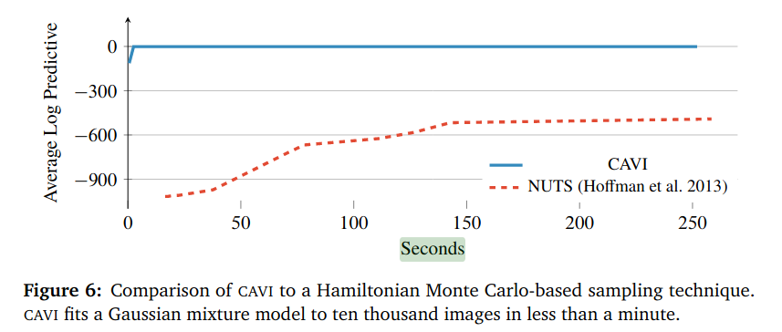

```{r setup, include=FALSE}
knitr::opts_chunk$set(echo = FALSE)
```

## Schedule Information

- HW4 Out now
- Keep working on project paper and presentation
- HW5 will be due 8/10 as well 
- check your participation tracker data


## Big Picture 

1. The primary object of interest/inference is the **parameter posterior** $p(\theta \mid y)$

2. We don't have a formula for it, and we can't draw samples from it.

3. We'll review variational inference--finding an approximate formula for it.


## Variational Bayes


```{r pressure, echo=FALSE, fig.cap="From https://arxiv.org/pdf/1601.00670.pdf", out.width = '100%'}

```


## Today

A complete example of a model with latent variables. 

Approximating $p(\theta, x_{1:n} \mid y_{1:n})$.

We will approximate a **joint** posterior, not just $p(\theta \mid y_{1:n})$

Typically the set of "everything that's unknown" is denoted as $z$.

For us:
$$
z = (\mathbf{x}_{1:n}, \theta)
$$


## Variational Bayes

Say $z = (z^1, \ldots, z^J)$. The approximate posterior is assumed to have the following form:

\begin{align*}
g(z ) &= g_j(z^j )g_{-j}(z^{-j} )
\end{align*}

**Coordinate ascent variational inference** will update one component at a time


## Variational Bayes

We need something that tells us the "distance" between two **distributions**. We need **Kullback-Leibler divergence**

$$
\text{KL}(g || p) = - \mathbb{E}_{g}\left[\log \frac{p(z \mid y) }{g(z) } \right] \ge 0
$$

When the functions in the numerator and denominator are equal at **every** value of $\theta$, then the quantity is equal to $0$. 


## Variational Bayes

Recall 

\begin{align*}
\text{KL}(g || p) 
&= - \mathbb{E}_{g}\left[ \log\frac{  p(y , z)}{g(z )} \right] +  \log p(y)  
\end{align*}

or

$$
\text{KL}(g || p)  + \text{ELBO}(g) =  \log p(y)  
$$
We deal with the ELBO

## Coordinate Ascent Variational Inference

With CAVI (a specific case), we update one component at a time. At the beginning of the update, we have

$$
g_j(z^j )g_{-j}(z^{-j} )
$$
and after updating the $j$th component, we have

$$
\tilde{p}(z_j) g_{-j}(z^{-j} )
$$

where 
$$
\tilde{p}(z_j) \propto \exp \left[ \int\log p(z,  y)g_{-j}(z_{-j} ) \text{d}z_{-j} \right]
$$

This update always decreases KL divergence because it always increases the ELBO.


## Coordinate Ascent Variational Inference

Our example in a Jupyter notebook:

- parameters: $p_1, \ldots, p_n, \pi, \mu_0, \Lambda_0, \mu_1, \Lambda_1$
- hidden variables: $x_1, \ldots, x_n$
- $z$ is the collection of all of this


```{python, eval = FALSE, echo = TRUE}
# refine g over and over again
for i in range(big_num):
    g = update_x(g, data, prior)
    g = update_pi(g, data, prior)
    g = update_mu_lambda_zero(g, data, prior)
    g = update_mu_lambda_one(g, data, prior)
```

  

## Coordinate Ascent Variational Inference

The bottleneck is usually our ability to derive expectations of 


$$
\log p(y , z) = \log p(y \mid x, \theta) + \log p(x \mid \theta) + \log p(\theta)
$$

Typically this means your models will have to have:
- exponential family distributions
- lots of independence and conditional independence


## Coordinate Ascent Variational Inference


Let's go to `GMM_VI_demo.ipynb`
  
  
## Variational Bayes


Next class:

  - more examples
  - a recent "more automatic" version
  - using it in `PYMC`


